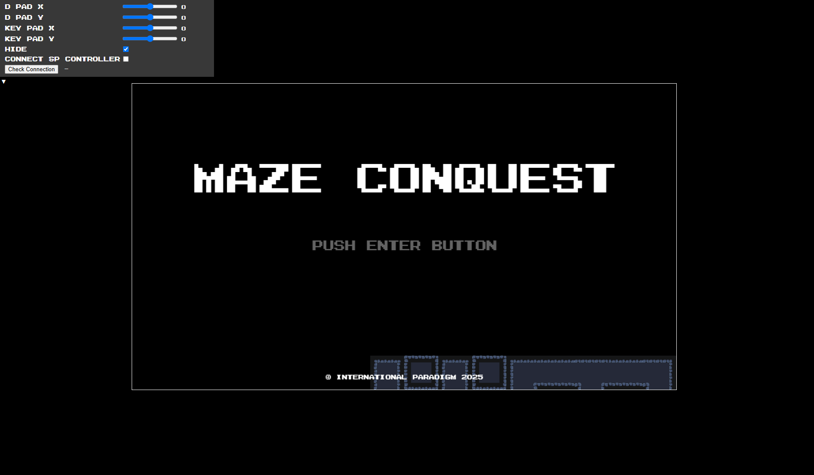
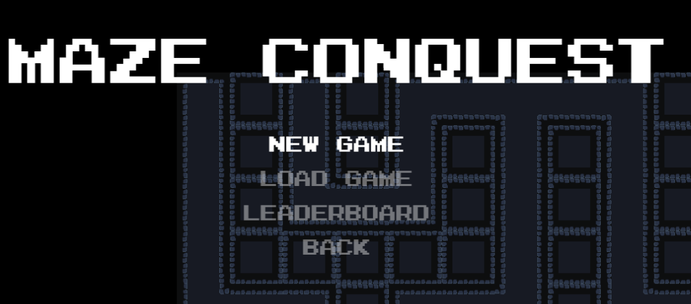
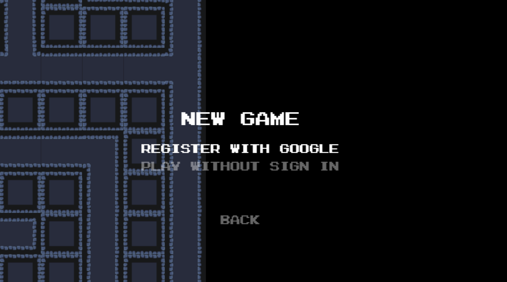
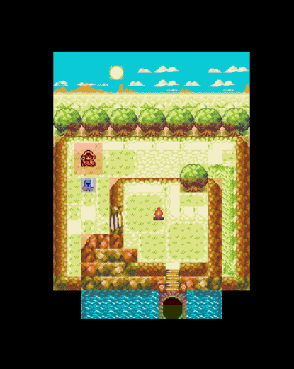
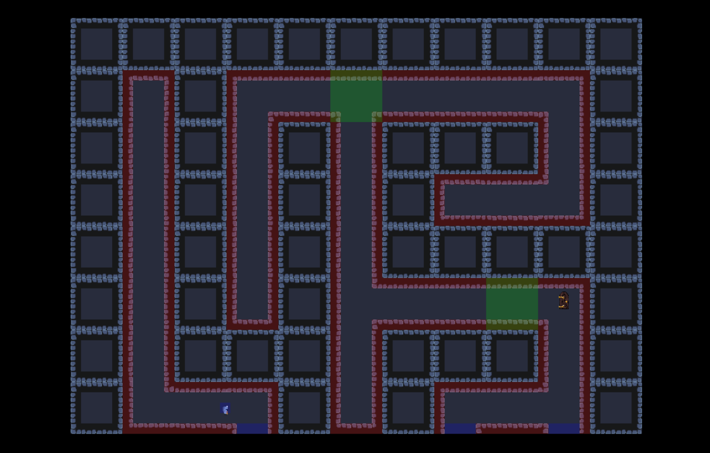
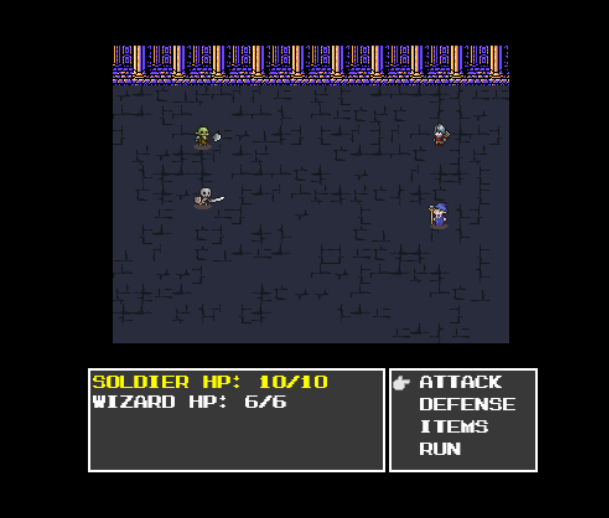
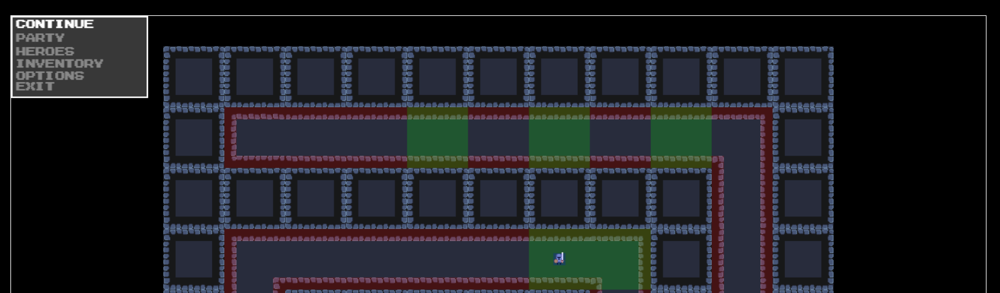

# Maze Conquest

#### 🌐 Access real game here

👉 <a>https://imakeyouhappy.site</a>

#### 💬Documentation in 2 languages

👉 <a href="#English">English Documentation</a>
👉 <a href="#日本語">日本語のドキュメント</a>

---

## 📝<span id="English">English<span> Documentation

## 🌟Bookmark

- <a href="#en-description">Description</a>
- <a href="#en-how-to-play">How to play</a>
- <a href="#en-technologies">Technologies</a>
- <a href="#en-install-locally">Install locally</a>
- <a href="#en-about-project">About Project</a>

## 📃 <span id="en-description">Description</span>

An RPG game, with infinite level of the deep. Player level up to gain power, and conquest to infinite maze. The deeper maze you go, the harder enemy will become. You can play anywhere you want, use your Google email to save your progress to cloud !

## 🎮 <span id="en-how-to-play">How to play</span>

❗Quick guide for controller
| Platform | Buttons |
| --------- | ------------------------ |
| `Computer` | `w a s d` : move/select `Enter` : Confirm `Space` : Cancel, Open Menu |
| `Smartphone (android/ios)` | There are a buttons at a screen. For the first time access the website, controller should be appear |
| `Wireless Controller` | You could wirelessly and seamlessly control the player/command using your smartphone, reference to this repository <a href="https://github.com/AaronFabian/maze-conquest-sp">`https://github.com/AaronFabian/maze-conquest-sp`</a> |

1. Press `Enter` in your keyboard! This you open Maze Conquest url <a href="https://imakeyouhappy.site">`https://imakeyouhappy.site`</a>, this should be your first screen and you will be see this game opening like below.
   
2. Are you new to this game or our veteran gamers ? If you are new to this game then you should choose `NEW GAME` otherwise choose `LOAD GAME` to continue your progress
   
3. If you choose `NEW GAME`, There are 2 options ! `REGISTER WITH GOOGLE` & `PLAY WITHOUT SIGN IN`. Do what your like, it's recommended to choose `REGISTER WITH GOOGLE` since it will save your game progress and you could continue everywhere you like. _Let's enjoy the game !_
   
4. You will begin at the `Beginning Town`. Notice the `red spotlight` character. She will handle saving your progress to the cloud. If you go to portal door like at the bottom, It will transfer you to the _Maze_
   
5. Here is the preview of the Maze. **Brace Yourself !** Notice the `green spotlight` it indicate enemy, they will respawn randomly whenever you go to another side of the maze. the `blue spotlight` indicate there are another are you could go if you proceed. The `door` to go to next level of the maze located randomly, But _once it located they will never move_ so don't miss it !
   
6. Let say you encountered enemy. Here is the layout you will see.
   - `ATTACK`: Choose which one you want to attack. Damage variety base on your character level
   - `DEFENSE`: Whenever you uncertain with the condition, choose defense _currently under development_ ⛔
   - `ITEMS`: Let you open inventories, you could heal your character whenever you need
   - `RUN`: You could run from the battle if you must.
     
7. At any place, you could open inventory ! Press `Space` and inventory UI will be open. press `Enter` to confirm
   

   - `CONTINUE`: Back to game.
   - `PARTY`: See party current status. (HP, LV, etc...)
   - `HEROES`: Switch your heroes. _currently under development_ ⛔
   - `INVENTORY`: See list of items (potion, hi potion, phoenix feather, etc...)
   - `EXIT`: Back to title screen. caution: make sure to save your progress before exit game.

   ❓Quick tips: use `Phoenix Feather` to escape from dungeon.

## 👨‍💻Technologies

- Frontend 🌐

  - JavaScript
    Base game, all JavaScript in this project generated by TypeScript, except libraries.
  - TypeScript
    This project written 100% with TypeScript, in this project Object Oriented Programming Design Pattern are carefully written for scalability.
  - Browser Canvas API
  - Tween JS
    Animation Library, asynchronously animating value.
  - Webpack
    JavaScript compiler, make file more compact and give code to run compatible at any legacy/old version browser. Also development server created by webpack.
  - Node
    Required for installing all required dependencies.

- Backend 📡

  - GO
  - GO Fiber
  - Firebase Client
    Refer to this repository for more details 👉 <a href=""></a>

- Infrastructure 👷

  - Google Cloud Run
    This application use stateless server, run whenever they needed.
  - Google Firebase Firestore (Database)
    Any data that no more than 1MB, image will not stored here as well.
  - Google Cloud Storage (Object Storage)
    Browser image asset will be stored at Google Cloud Storage.
  - Docker
    Releasing this app use container to run.
  - Github Action CI/CD
    In this repository, after merge to main branch, the /dist folder will be automatically pushed to backend repository.

## 🔻<span id="en-install-locally">Install locally</span>

| Warning                                                                                                                |
| ---------------------------------------------------------------------------------------------------------------------- |
| Application may not work properly for everyone. Backend verification, environment variable are required.               |
| Local git is required. download local git 👉 <a href="https://git-scm.com/downloads">https://git-scm.com/downloads</a> |

1. Open / create folder you want to place this application. From opened / created folder, paste terminal command below.

   ```bash
   git clone https://github.com/AaronFabian/maze-conquest.git
   ```

2. Open project folder.

   ```bash
   cd ./maze-conquest
   ```

3. Install the JavaScript dependencies.

   ```bash
   npm install
   ```

4. Run locally.
   ```bash
   npm run dev
   ```

## 💬<span id="en-about-project">About Project</span>

This is my first fullstack development project. I tried to combine all my knowledge I have to create this project. Fun fact, RPG game is my favorite game genre ! My next target in the future I could create online game application. Thank you, wish you all the best _- Aaron Fabian_ 😊

---

## 📝<span id="日本語">日本語<span> ドキュメンテーション

## Description

## Technologies

## 🔁 リクエストのルール（ルーター）

関数は、リクエストのパス（`req.path`）を見て、どの処理を行うか決めます。

| パス      | 説明                     |
| --------- | ------------------------ |
| `/create` | 新しいデータを作成します |
| `/update` | データを更新します       |
| `/delete` | データを削除します       |
